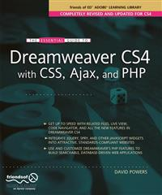

# Apress Source Code

This repository accompanies [*The Essential Guide to Dreamweaver CS4 with CSS, Ajax, and PHP*](http://www.apress.com/9781430216100) by David Powers (Apress, 2009).

Download the files as a zip using the green button, or clone the repository to your machine using Git.

## Releases

Release v1.0 corresponds to the code in the published book, without corrections or updates.

## Contributions

See the file Contributing.md for more information on how you can contribute to this repository.
